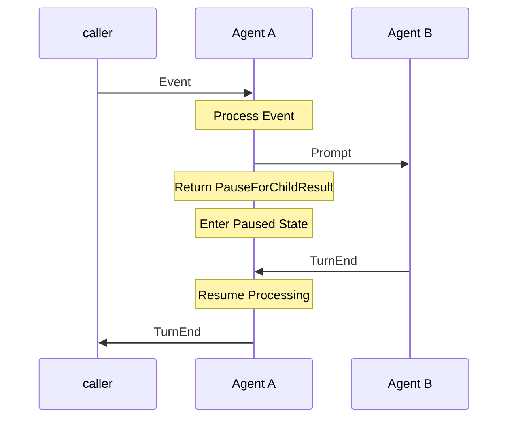
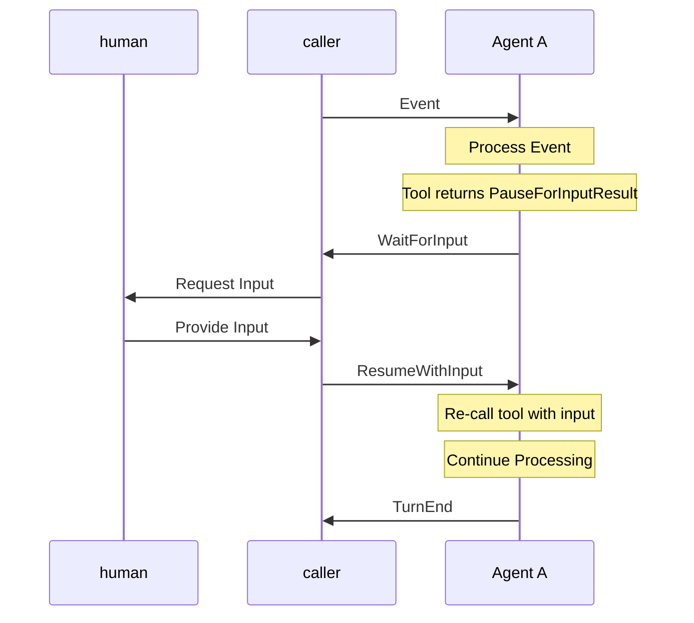
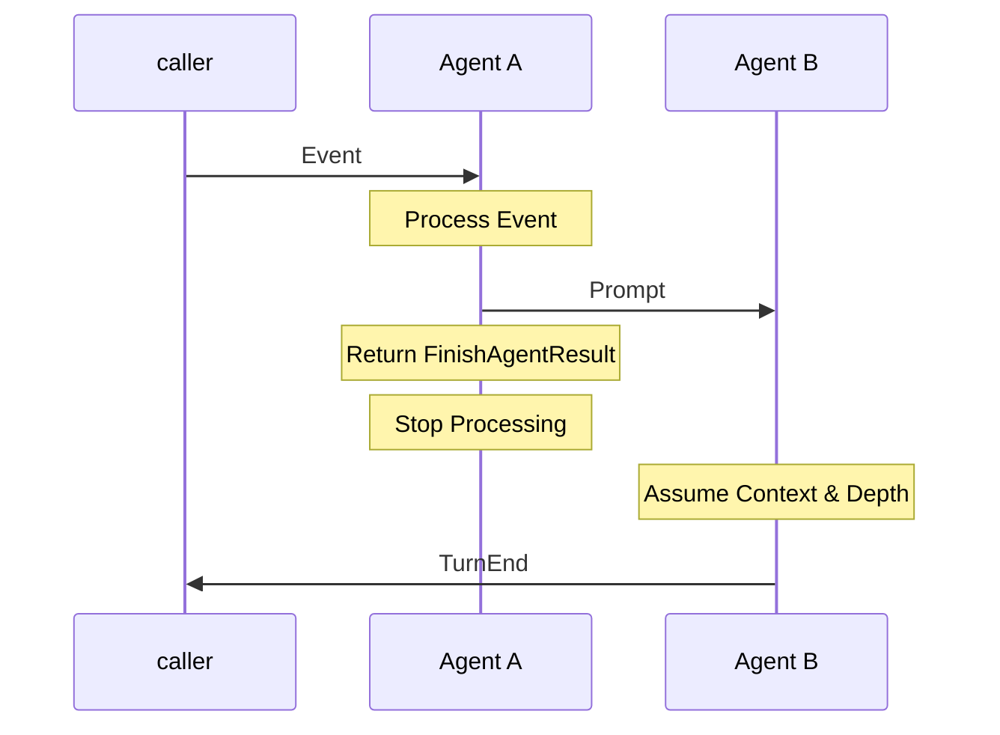

# Agent processing flow

Forward direction processing happens by sending events to agent, which may send
events to sub-agents, and those agents emit events back with results.

### Special tool results:

`PauseForChildResult`  - Put the agent in a paused state, and wait for `TurnEnd` to come
back from a sub-agent call. Assumes the event has **already** been sent to the child.

`PauseForInputResult`  - Put the agent in a paused state, and emit a `WaitForInput`
event back to the caller. Wait for the `ResumeWithInput` event to come back from the caller.

`FinishAgentResult` - Special result to indicate that we have sent a handoff Prompt
to the next agent, and this agent can finish execution (without sending TurnEnd).

When Agent A calls Agent B, it sends a `Prompt` message and then enters a "pause" state
(by having the sub-agent tool call return `PauseForChildResult`).

The pause state is mid-way through an LLM function call. When the `TurnEnd` event is 
received from agent B then Agent A can resume by processing the result as the
result of the tool call.

When Agent A wants to "pause for human", then it needs makes a local tool
call which returns a `PauseForInputResult` result. This puts the agent in a paused
state and its emits a `WaitForInput` event back to the caller. 
The caller should collect input and send a `ResumeWithInput` back to agent A.
Agent A handles this event by _re-calling_ the tool function with the human
input. The tool function can process or return the value as is. Agent A then
processes this as the result of the original tool call.

So Agent A can be paused waiting on _upstream_ or _downstream_, but resuming
processing looks the same: treat the result as the result of a function call
and continue processing.

### Handoff

_Handoff_ is when agent A calls agent B, but then "hands off" its turn to Agent B.
Agent A stops processing. Agent B assumes current context, the original caller,
the original depth, and is expected to emit the `TurnEnd` event back to the original
caller. It should also emit the 

### Case 1: Normal Sub-Agent Call with PauseForChildResult

### Case 2: Pause for Human Input

### Case 3: Handoff to Another Agent

